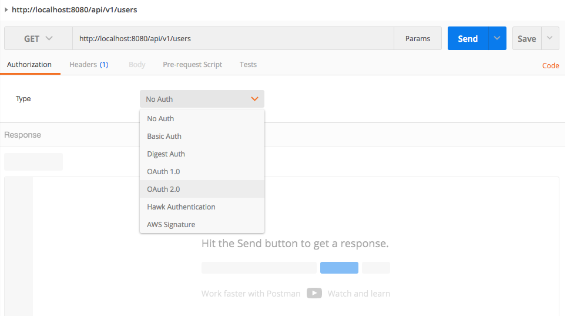

## Development
Information on how the development team agrees to work together along with information on setting up a local dev environment. Keep this document fresh with any and all information that should be shared with your fellow devs.

## Table of Contents
* [Core Values](#core-values)
* [Code Standards](#code-standards)
* [Workstation Setup](#workstation-setup)
* [Run App Locally](#run-app-locally)
* [Code Branching](#code-branching)
* [Code Review & Merge](#code-review--merge)
* [Continuous Integration](#continuous-integration)

Also check out [Development Recipes](DEVELOPMENT-RECIPES.md).

## Core Values
These are the core standards that our development team agrees to follow. All of our decisions should be tested against our core values. Only a team decision can overrule our core values on a case-by-case basis. 

1. __Always act in the best interest of our customer's time, money, and desired quality__
  * We succeed when our customer is amazed at our ability to deliver on-time, within budget, and with the highest possible quality given the time and money constraints. 
  * Test every decision with the question "Does this align with the customer's budget, timeline, and quality expectations?"
2. __Be respectful always (aka Golden Rule)__
  * Teams that respect each other with their words and actions achieve high throughput consistently
  * When we talk down to each other we are deciding that WE are more important than the customer!
3. __No Lone Ranger Developers__
  * Acting on your own excludes your team from decision making, which is a form of disrespect
  * Perfect code is a product of team collaboration and communication
4. __Peer code reviews are required__
  * For every 10 lines of code written ~ 1 bug is introduced into the code base. 
  * Peer reviewed code has been found to significantly reduce bugs and missed requirements
  * Be thorough and respectful!
5. __Build for today's needs, not what might be needed tomorrow__
  * Read [YAGNI](https://martinfowler.com/bliki/Yagni.html) by Martin Fowler for examples of "You're Not Going To Need It"
  * Make the best choices based on the customer's concrete needs today!
  * Building for the future is subjective guesswork that rarely meets unknowable customer needs

:arrow_up: [Back to Top](#table-of-contents)

## Code Standards
The following coding standards are agreed upon by the development team and are expected to be followed. Where possible, these rules will be enforced by the IDE. The goals of these standards are the following:

1. Create a consistent look to the code, so that readers can focus on content, not layout.
2. Enable readers to understand the code more quickly by making assumptions based on previous experience.
3. Facilitate changing and maintaining the code in a consistent manner.

__Languages__
* [Groovy](STANDARDS-GROOVY.md)     
     
__Best Practices__
* [Database](STANDARDS-DATABASE.md)
* [Spring Framework](STANDARDS-SPRING.md)
* [Web Services](STANDARDS-WEB-SERVICES.md)

:arrow_up: [Back to Top](#table-of-contents)

## Workstation Setup

### Required Software
Download and install the following required software for development:
* [Java SDK 1.8](http://www.oracle.com/technetwork/java/javase/downloads/jdk8-downloads-2133151.html)
* [MySQL Community Server - Database](https://dev.mysql.com/downloads/mysql/)
* [MySQL Workbench](https://dev.mysql.com/downloads/workbench/) or [Sequel Pro Mac OSX](https://www.sequelpro.com)
* [IntelliJ](https://www.jetbrains.com/idea/)
  * Plugin: [Spock Framework Enhancements](https://plugins.jetbrains.com/plugin/7114-spock-framework-enhancements)

### Instructions
1. Download source via IntelliJ VCS
   - Open IntelliJ
   - Using the top menu, navigate to "VCS -> Checkout from Version Control -> Github"
   - If you have not used Github from IntelliJ before, you will be asked for your Github credentials
   - Once authenticated, you will see a dropdown containing a list of repositories you have access to
   - Choose "https://github.com/lssinc/voyage-api-java.git" from the list of repositories
     * The official repository is located here https://github.com/lssinc/voyage-api-java
   - Use the default path provided or change it to your desired path
   - Click "Clone" to create a local git repo with the GitHub repo as a source


2. Create the database
   - Use MySQL Workbench to connect to your locally running instance of MySQL
     * Hostname: 127.0.0.1
     * Username: root
     * Password: > the password you entered during installation <
   - Click the "Create a new schema in the selected server" button and enter the schema name "voyage"

   
   - Click the "Apply" button
   - Click "Finish" on the popup that appears to create the schema.
   - Go to the "Users and Privileges" section.
   - Click "Add Account" and create a user with username and password "voyage".
   - Click the "Administrative Rolls" tab and check the checkbox next to "DBA".
   - No other manual steps are required for the database, all tables will be created on app startup via Liquibase migration scripts.

   

3. Build Voyage
   - Configure the app database connection
     * The default database configuration is located in /src/main/resource/application.yaml
     * The "spring.datasource" section of the application.yaml file contains the database URL, username, and password
     * Change these details to connect to any database with any credentials
     * NOTE: You can also override these properties following the [Spring Configuration externalization conventions](https://docs.spring.io/spring-boot/docs/current/reference/html/boot-features-external-config.html)
   - Invoke the "build" Gradle task from the Gradle Tool Window
     * Open the Gradle Tool Window by navigating to "View -> Tool Windows -> Gradle"

   
   - This tool window will show you a list of Gradle tasks.
   - Run the "build" task under the "build" section to build the project.

> __SEED DATA__
>
> A default "admin" user with full access to everything will be seeded into the database when _Update-Database_ is run. Use this account when initially interacting with the web services or creating new users or applying new user roles. 
```
Username: super
Password: password
```

:arrow_up: [Back to Top](#table-of-contents)

## Run App Locally
* [Quick Guide](#quick-guide)
* [Access Secured Web Services](#access-secured-web-services)
* [Common Gradle Tasks](#common-gradle-tasks)
* [Troubleshooting](#troubleshooting)

### Quick Guide
1. Run the tests
   - Before running the app locally, execute the tests to ensure the app code is working as expected.
   - Gradle Task: test
     * In the Gradle tool window, run the "test" task under the "verification" section.
   - IntelliJ will run all tests and display failures in a console window pane

2. Run the application
   - Gradle Task: bootRun
     * In the Gradle tool window, run the task "bootRun" under the "application" section.
     * This will run any un-run migration scripts, build the project, and start a server on port 8080.
     * Wait for the console to display "Started App in xx.xxx seconds (JVM running for xx.xxx)" before accessing the app
   - Access the running app at `http://localhost:8080`

   

3. Access an API
   - `http://localhost:8080/api/status`
   - `http://localhost:8080/api/v1/users` - requires authentication (see next section Access Secured Web Services)

### Access Secured Web Services
By default, the API secures all webservice endpoints with the exception of the /api/status public endpoint. Without going
into how you secure a webservice endpoint (see Developer Recipes), this section will discuss the default OAuth2 security
implementation and how to access web services. 

#### Oauth2: Quick Overview
OAuth2 is an authentication method that allows for 2 authenticating actors: Client, User. 
* Client - the 'app' that is making the request to the API
* User - the person that is using the app to make a request to the API

Currently, the API supports 2 OAuth authentication methods 
* Client Credentials - Client only authentication used mainly for server-to-server exchanges 
* Implicit Authentication - Client + User authentication use mainly for web and mobile apps 

#### OAuth2: Client Credentials
##### Overview
* The client accesses the API directly without a user and uses a secure password to authenticate.
* The client is the only actor using the API and must provide a client ID and password
* The API will not load a User object into the session unless the client ID maps to a User username
* API services that require a User object loaded into memory will not function with this authentication method
* This authentication method is reserved for testing and for server-to-server exchanges

##### Web Service: `http://localhost:8080/oauth/token`
* used for Client Credential authentication
* pass in the Client ID and Client Secret and get back an access token
* returns a JWT bearer token that expires within a few hours

##### Client seed data
* client id: client-super
* client secret: secret
* see `/src/main/resources/db.changelog/v1-0/client.yaml`

##### Test Using cURL 
```
curl -u client-super:secret -X POST -d "client_id=client-super&client_secret=secret&grant_type=client_credentials" http://localhost:8080/oauth/token

```

* Send the Client ID and Client Secret via basic auth
* POST to: /oauth/token
* POST data: client_id, client_secret, grant_type=client_credentials
* The result will be an access code value

##### Test Using Postman

1. Within the Authorization section of a Postman request, choose the "OAuth2" option 


2. Click the orange "Get New Access Token"


3. Enter the token URL and login information. Be sure to select Grant Type "Client Credentials" 


4. Click on the new token row and select "Use Token" orange button to apply the token to your request.


5. Click on the Headers section to verify that the Authorization header has been applied with the Access Token


#### OAuth2: Implicit Authentication
##### Overview
* The user instructs the client 'app' to make API requests on the user's behalf. 
* The client initiates the authentication using their client ID, but does not provide a password because
  the user will be required to enter their own username and password to authorize the client. 
* The API will load both the Client and User objects into the session
* This authentication method is the preferred method for a web or mobile app

##### Web Service: `http://localhost:8080/oauth/authorize`
* used for Implicit Authentication
* accepts the Client ID, redirect url, and few other params
* redirects a server-side user login form
* upon successful authentication of the user and client, a redirect back to the caller with the access token.
* returns a JWT bearer token that expires within a few hours

#### Client seed data
* client id: client-super
* client secret: secret
* see `/src/main/resources/db.changelog/v1-0/client.yaml`

#### User seed data
* username: super
* password: password
* see `/src/main/resources/db.changelog/v1-0/user.yaml`

#### Test Using Browser
The method described below is easiest to perform within a web browser. While it is possible to do this within cURL,
it takes more effort to handle the temporary session cookie and to follow redirects. The simplest way is to use a browser,
which will be demonstrated below. 

1. Copy/paste the following URL into your browser address bar 
   `http://localhost:8080/oauth/authorize?client_id=client-super&redirect_uri=http://localhost:8080/oauth/&response_type=token`
   
   * Endpoint Address: http://localhost:8080/oauth/authorize
   * Parameters:
     - client_id - the client identifier
     - redirect_uri - the address to redirect back to with the access token upon successful user authentication
     - response_type - the expected type of code to return back on the redirect_uri (code=temp code, token=longer term access token)
   * This assumes you are using the default seed data that comes with the app (see /src/main/resources/db.changelog/)

2. Login as the 'super' user
   
   * Username: super
   * Password: password

3. Accept the Grant Request
   

4. Retrieve the Access Token from the URL parameters
   
   
   
   
   * Upon successful authentication, the app will redirect to the given redirect uri
   * The redirect uri doesn't likely existing on you local environment (or any environment)
   * You will receive a 404 Not Found error page
   * Look at the URL and you will see that there is a #access_token=eyJhbGciOiJSUzI1NiIsIn... as a parameter
   * Copy the entire URL out to a text editor and copy the enter access_token value

   Example access token: `eyJhbGciOiJSUzI1NiIsInR5cCI6IkpXVCJ9.eyJleHAiOjE0ODkxMjg4NDcsInVzZXJfbmFtZSI6InN1cGVyIiwiYXV0aG9yaXRpZXMiOlsiYXBpLnBlcm1pc3Npb25zLmRlbGV0ZSIsImFwaS5yb2xlcy5kZWxldGUiLCJhcGkucm9sZXMudXBkYXRlIiwiYXBpLnBlcm1pc3Npb25zLmxpc3QiLCJhcGkucGVybWlzc2lvbnMudXBkYXRlIiwiYXBpLnVzZXJzLmNyZWF0ZSIsImFwaS51c2Vycy5nZXQiLCJhcGkudXNlcnMubGlzdCIsImFwaS5wZXJtaXNzaW9ucy5nZXQiLCJhcGkucm9sZXMuZ2V0IiwiYXBpLnVzZXJzLnVwZGF0ZSIsImFwaS5yb2xlcy5jcmVhdGUiLCJhcGkudXNlcnMuZGVsZXRlIiwiYXBpLnBlcm1pc3Npb25zLmNyZWF0ZSIsImFwaS5yb2xlcy5saXN0Il0sImp0aSI6ImY0NTlkZWEwLTJlNGQtNDgxNi1hMjUwLTQ5YjhjNzQ5Mjg5YiIsImNsaWVudF9pZCI6ImNsaWVudC1zdXBlciIsInNjb3BlIjpbIlJlYWQgRGF0YSIsIldyaXRlIERhdGEiXX0.OAKT6c5cpfwkzlQRz5AS_svSRWBROo_UN6I9_aE2EHky4OjGUwh7DExiDTYwr-kcLE9o1P7ZDW28g_f2SZVpx8AYosOJiN727060zbrT1q2shmnKhVv7pQJomzshdrXdCo0Lwz1eQ7punQv21mwEohIz4x0aX8IrxkcV8_-1hanGyKYkcdRdOdcWKYx2D_2k1_Z_wRhLuyV8vhmtjOPqWpNBjg6XmwRyA2GaRxJQAsWlQdyGC69GOLV4HVCgPJSUX7rgK1yatVGR8WyTcXclTmb9E9XBrom2zkq2NxZ4ZDVnHu6oq9Fszv3BbM-uwsPggFFG0D0YKG6s00uetXWz_A`

5. Copy the access token into the Authorization header of a webservice request (via cURL or Postman)
   


### Common Gradle Tasks
[Gradle](https://gradle.org) is the Java/Groovy build framework used to compile, test, analyze, package, and run the application.
Popular IDEs like IntelliJ or Eclipse have plugins that support executing Gradle tasks from within the IDE with the output
 displayed within a console window of the IDE. 
 
 To access the Gradle tool window in IntelliJ, click menu option View > Tool Windows > Gradle. The following categories
 will be found within the Gradle tool window. Double clicking on a task will execute the task and display the results in
 an IDE console window. 
 
* application
  - bootRun
    - starts a local instance of Apache Tomcat and "injects" the app into the Tomcat container.
    - runtime logs will be displayed in the console
    - startup is complete when you see the log line "Started App in ___ seconds (JVM running for xx.xxx)"
* build
  - clean
    - cleans out the /build folder and any other build artifacts gradle creates when building the app
    - useful when you want to build from scratch or if your app doesn't seem to be working as expected
  - build
    - compiles all of the classes
    - not used very often since this task is executed when 'bootRun', 'test', and 'war' are executed
  - war
    - creates a Web Archive (.war) file used to deploy into J2EE Servlet Containers like Apache Tomcat or RedHat JBoss
    - stores the .war file in /build/libs folder
* other
  - codenarcMain
    - invokes the CodeNarc static code analysis process on the /src/main files.
    - CodeNarc rules are located in /codenarc/codenarc-main.rules
    - a local file:// url will be displayed at the end of the codenarc process with details on the issues identified in the static code analysis
    - this task should be executed before committing code to the Git repo
    - this task is run during the CI/Jenkins build-test process and will fail the build if analysis fails 
  - codenarcTest
    - same as codenarcMain
    - CodeNarc rules are located in /codenarc/codenarc-test.rules
* verification
  - test
    - invokes all unit and integration tests found within the /src/test folder of the application
    - displays successes and failures in the console. IntelliJ or other IDEs will display a success/failure within a console window
    
### Troubleshooting
* Tests are failing when I run them locally
   - Check to see if you have made any changes locally that would be adversely affecting tests
   - Verify that tests are running within the Continuous Integration site (ie Jenkins)
   - Examine the tests that are failing and see if there is a common pattern to why they are failing
   - Pull in a peer developer or contact Voyage support for assistance if you cannot resolve the issue.
* Executing 'bootRun' fails with liquibase checksum errors on some of the migration scripts 
   - This is due to changes being made to the liquibase migration scripts that have already been applied to your local database
   - The fastest way to resolve this is to drop your local database and create a new database (see steps in the Workstation Setup instructions)
   - An alternative fix is to go into the DATABASECHANGELOG table in your database and delete the rows for the failing 
     migration files. You will also need to manually revert the changes that this migration file applied so that when 
     the migration script(s) run again, they don't fail trying to apply changes that already exist. 
  
  
:arrow_up: [Back to Top](#table-of-contents)

## Code Branching
The following code branching strategy is meant to ensure the following objectives: 
* Encourage the benefits of frequent commits/pushes to the Git repo
* Isolate work-in-progress from other developers
* Tag branches with meaningful names to identify features
* Only promote peer reviewed code into the "master" branch
  
> __All Branches Work The Same Way__ There are many strategies that may be employed when branching. Regardless of the branching strategies that are used, it's helpful to know that technically branches all function the same way. Terms like "long running branches" or "topic branches" simply refer to a strategy for how to use the branching feature of Git.
  
### Long Running Branch: Master
A project can support multiple "long running" branches that are always open and ready for new code. It's typical to have a long running branch called "master" that holds stable code that is currently in production and code soon to be deployed to production. It's not uncommon for development teams to have a long running branch called "develop" that contains less stable code that needs to be tested and verified before being pushed to the more stable "master" branch. 

The current development practice for this team is to only support a "master" long running branch that will hold all code currently in production and new code that has been peer code reviewed. 

### Topic Branches
Topic branches are shorter lived branches are often times referred to as "feature branches". Topic branches can be thought of as workspaces for developers to make their code changes for a single (hopefully small) feature. 
```
 --------- MASTER ---------------------------------------> Production
    \-- Topic #123 --/     \---- Topic #124 ----/
```

Topic Branch Workflow

1. Create a new branch from a long running branch like "master"
  * Name the Topic branch with the ticket number from your task management app + short english description (ie LP-1234 Navbar Quick Search)
  * Creating a good name allows for quick comparison of the task management app and Git for what's in the release and what's not
3. Make code changes
  * Commit to the local Git repo as often as necessary using descriptive commit messages
  * Write meaningful commit messages as these will often be read by peer developers
4. Push code changes
  * Push to the Topic branch in the Git repo as often as necessary so that changes wont be lost if your computer blows up
5. [Pull Request](https://help.github.com/articles/about-pull-requests/)
  * Create a pull request (if available in your Git repo) and ask 1-2 developers to review the code online
  * GitHub and BitBucket both have great diff tools for doing code reviews on-demand and providing comments. 
6. Peer Reviewer Merge
  * Once the peer reviewer has signed-off on the changes, then ONLY THE PEER REVIEWER can merge the changes into the long running branch "master"
  * The developer's name on the merge is the official stamp of approval and statement that the code reviewer takes responsibility for the quality of the code. 
7. Delete Topic Branch
  * Topic branches that have been merged into "master" should be deleted immediately as they are no longer necessary
  * Work with the team to determine if a different time interval is needed for retaining old branches and update this document
  
### Other Strategies
This guide is focusing on the simplest branching strategies so that even the least experienced person on the team (at least with Git) can quickly get familiar with the workflow. Starting with a complext branching strategy can be a frustrating experience that can cause confusion in a team. If your team is an advanced group ready for the next level of Git, then consider updating this section with you preferred Git workflow strategies and training your team so as to avoid confusion and mistakes. 

Read [Git - Branching Workflows](https://git-scm.com/book/en/v2/Git-Branching-Branching-Workflows) for more information. 

:arrow_up: [Back to Top](#table-of-contents)

## Code Review & Merge
Peer code reviews are perhaps the _most_ important team development step in a project. Code reviews are an opportunity for team members to catch oversights in code, bugs, standards, and best practices. Code reviews are also opportunities for developers to teach each other about our documented standards and guidelines as well as to share other general development knowledge and best practices from experience. Further more, code reviews encourage developers to share work-in-progress frequently and to develop respectful and trusting relationships (ie team building). 

Once a thorough code review has been completed, the peer reviewer will perform the merge process to the long running branch (i.e. master), which will stamp the reviewers name on the merge to show the code was reviewed and approved. 

__Rules__
* All tests _must_ pass on the developer's machine before requesting a code review
* It is _your_ responsibility to have _your_ code reviewed in a timely manner
* It is _never_ acceptable to have your code merged into a long running branch without a code review
* Merging code into a long running branch can only be performed by the peer code reviewer
* You are required to fix any violations of the __documented__ team dev standards/guidelines
* Peer reviewer recommendations that are not supported by documented team dev standards/guidelines are optional
* Seek to have your code reviewed by someone more experienced so that you can learn something new!
* Change up who reviews your code to promote cross training and to learn from new people
* Make time to provide a thoughtful code review. 
* Be kind and follow the [Golden Rule](https://en.wikipedia.org/wiki/Golden_Rule) 

:arrow_up: [Back to Top](#table-of-contents)

## Continuous Integration
Continuous Integration (CI) is the process of integrating and testing new code as soon as the code has been merged into a long running branch. Typically CI is managed by a system like [Jenkins](https://jenkins.io/index.html) that have custom jobs created for each project and environment combination. CI jobs can be executed manually, through commits in a source code repo, or through plugins that support nearly any type of trigger. 

Developers must be aware that as soon as their code is merged into a long running branch (ie master), that the CI job "Build & Test" will be triggered on the new code. The primary function of the "Build & Test" job is to ensure that the latest changes can be built without error and that all unit, integration, and functional tests pass successfully. If the build or a single test fails, then the job fails and notifies the development team. 

Whenever a job fails within the CI environment the whole development team is affected. It is the responsibility of the developer who broke the build to fix the issue as quickly as possible. A developer with repeated offenses should be made aware (however the team decides) that they need to improve their pre-merge quality checks. 

Learn more about Continuous Integration within the [Deploy: Continuous Integration](DEPLOY.md#continuous-integration-ci) documentation.

:arrow_up: [Back to Top](#table-of-contents)
