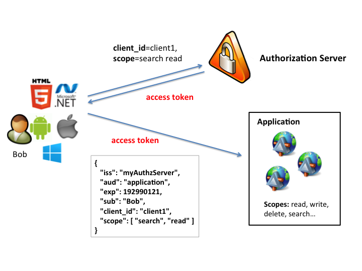

## Security
Overview of the Security features and configurations that have been implemented within the Voyage API. 

## Table of Contents
* [Secure Programming](#secure-programming)
* [Security Features](#security-features)
  - [Account Locking](#account-locking)
  - [Authentication: OAuth2 (default)](#authentication-oauth2-default)
  - [Authentication: Spring Security](#authentication-spring-security)
  - [Authorization: Permission Based](#authorization-permission-based)
  - [2-Factor Authentication](#2-factor-authentication)
  - [Cross Origin Resource Sharing (CORS)](#cross-origin-resource-sharing-cors)
  - [Cross Site Request Forgery (CSRF)](#cross-site-request-forgery-csrf)
  - [OWASP Top 10](#owasp-top-10)
  - Password Attempts Tracking
  - Password Policy
  - [Password Recovery](#password-recovery)
  - [User Verification](#user-verification)
* [Security Configuration](#security-configuration)
  - [CORS Configuration](#cors-configuration)
  - [Environment Specific Application Properties](#environment-specific-application-properties)
  - [JWT Public/Private Key Configuration](#jwt-publicprivate-key-configuration)
  - [Public Resources](#public-resources)
  - User Verification
* Audit Logging
  - Action Logs
  - Change Logs

## Secure Programming
The majority of technology security breaches that occur are through software applications. As developers create new software they need to be very mindful of secure programming principals in order to protect the users and companies that use the software. A developer needs to simply Google "Secure Coding" or "Secure Programming" to find many articles on best practices for secure programming. We've included a number of references below that are a great start. 

All programmers working on this app should at least read through the reference materials and take the introductory courses on secure programming offered by the [OWASP Academy](http://owasp-academy.teachable.com) with course title 'OWASP AppSec Tutorials' by Jerry Hoff. While the Voyage API lays down many protections within the frameworks and features it uses, every developer is responsible for understanding why these frameworks were put in place, how these frameworks fortify security, and what to do in their own code when they are building new features. 

#### References
* https://www.owasp.org/index.php/OWASP_Secure_Coding_Practices_-_Quick_Reference_Guide
* https://www.securecoding.cert.org/confluence/display/seccode/Top+10+Secure+Coding+Practices
* https://www.securecoding.cert.org/confluence/display/java/Java+Coding+Guidelines 
* http://owasp-academy.teachable.com
* https://www.lynda.com/Programming-Foundations-tutorials/Techniques-Developing-Secure-Software/418266-2.html

:arrow_up: [Back to Top](#table-of-contents)


## Security Features

### Authentication: OAuth2 (default)


#### Overview
The default security configuration of Voyage API is OAuth2 with the Implicit Authentication and Client Credentials authenticaiton workflows implemented. OAuth2 was chosen as the default authentication mechanism over a simple username/password workflow because it provides a common pattern implemented by many enterprises, allows for a more secure login process when using Implicit Authentication, and enables the API to be a branded Authorization server should it desire to allow third-party apps to interface with its web services. 

Voyage API implements OAuth2 natively within the application using [Spring Security OAuth2](https://projects.spring.io/spring-security-oauth/docs/oauth2.html) framework. 

Walk through accessing secured web services using both Implicit Authentication and Client Credentials in the [Development: Access Secured Web Services](./DEVELOPMENT.md#access-secured-web-services) section. 

#### Authentication Server
The Authentication Server is an independent component of OAuth2 that is responsible for authenticating users and returning secure tokens for accessing the Resource Server. The Authentication Server can be a third-party entity (ie Google, Facebook) or a privately hosted server. Voyage API implements its own Authentication Server following the [Spring Security OAuth2](https://projects.spring.io/spring-security-oauth/docs/oauth2.html) defined structure.  

The configuration for the Authentication Server is discussed in more detail within the [Security Configuration](#security-configuration) section. The implementation of the Authentication Server can be found at `/src/main/groovy/voyage/config/OAuth2Config.groovy`. Within the config class, both of the Authorization Server and the Resource Server are defined. 

##### Highlights of the Authorization Server implementation:
```
@Configuration
class OAuth2Config {

    /**
     * Configures the OAuth2 Authorization server to use a custom ClientDetailsService and to govern access to
     * authorization endpoints.
     */
    @Configuration
    @EnableAuthorizationServer
    class AuthorizationServerConfig extends AuthorizationServerConfigurerAdapter {

        @Value('${security.jwt.key-store-filename}')
        private String keyStoreFileName

        @Value('${security.jwt.key-store-password}')
        private String keyStorePassword

        @Value('${security.jwt.private-key-name}')
        private String privateKeyName

        @Value('${security.jwt.private-key-password}')
        private String privateKeyPassword

        @Autowired
        private AuthenticationManager authenticationManager

        @Autowired
        private PermissionBasedClientDetailsService permissionBasedClientDetailsService

        @Autowired
        private WebResponseExceptionTranslator apiWebResponseExceptionTranslator

        @Bean
        JwtAccessTokenConverter accessTokenConverter() {
            KeyStoreKeyFactory keyFactory = new KeyStoreKeyFactory(new ClassPathResource(keyStoreFileName), keyStorePassword.toCharArray())
            KeyPair keyPair = keyFactory.getKeyPair(privateKeyName, privateKeyPassword.toCharArray())
            JwtAccessTokenConverter converter = new JwtAccessTokenConverter()
            converter.keyPair = keyPair
            return converter
        }

        @Override
        void configure(AuthorizationServerSecurityConfigurer oauthServer) throws Exception {
            oauthServer

                // Expose the verifier key endpoint "/oauth/token_key" to the public for validation of the JWT token
                .tokenKeyAccess('permitAll()')

                // Require users to be authenticated before accessing "/oauth/check_token"
                .checkTokenAccess('isAuthenticated()')
        }

        @Override
        void configure(AuthorizationServerEndpointsConfigurer endpoints) throws Exception {
            endpoints
                    .authenticationManager(authenticationManager)
                    .accessTokenConverter(accessTokenConverter())
                    .exceptionTranslator(apiWebResponseExceptionTranslator)
        }

        @Override
        void configure(ClientDetailsServiceConfigurer clients) throws Exception {
            clients.withClientDetails(permissionBasedClientDetailsService)
        }
    }
...
```
1. Extends the stock Spring Security OAuth2 framework
2. Implements stateless JSON Web Token (JWT) as the token provider with a changeable public/private key for encoding the token. 
   - See [Security Configuration](#security-configuration) for instructions on how to configure the JWT public/private key by environment
3. Implements a custom exception translator to ensure all expected or unexptected issues are handled consistently
4. Implements a custom Permission Based Client authorization service that grants access to resources based on the Permission records associated with their profile. 
   - See [Authorization: Permission Based](#authorization-permission-based) for more information. 
   - Inspect `/src/main/groovy/voyage/security/PermissionBasedClientDetailsService` for implementation details.

#### Resource Server
The Resource Server is an independent component of OAuth2 that is responsible for facilitating secured access to the web services provided by the API (ie HTTP GET /api/users). The Resource service is always implemented by the API application as it hosts the web services that comprise the API product. The Resource Server shouldn't need to know anything about the Authentication Server's location or how it operates other than the method by which to validate tokens and certify that they originated from the Authentication Server. Voyage API implements the Resource Server following the [Spring Security OAuth2](https://projects.spring.io/spring-security-oauth/docs/oauth2.html) defined structure.  

The configuration for the Resource Server is discussed in more detail within the [Security Configuration](#security-configuration) section. The implementation of the Resource Server can be found at `/src/main/groovy/voyage/config/OAuth2Config.groovy`. Within the config class, both of the Authorization Server and the Resource Server are defined. 

##### Highlights of the Resource Server config:
```
@Configuration
class OAuth2Config {
...

    @Configuration
    @EnableResourceServer
    class ResourceServerConfig extends ResourceServerConfigurerAdapter {
        private static final String ANY_PATH = '/**'
        private static final String API_PATH = '/api/**'
        private static final String READ = "#oauth2.hasScope('Read Data')"
        private static final String WRITE = "#oauth2.hasScope('Write Data')"

        @Value('${security.permitAll}')
        private String[] permitAllUrls

        @Autowired
        private WebResponseExceptionTranslator apiWebResponseExceptionTranslator

        @Override
        void configure(HttpSecurity http) throws Exception {
            http

                // Limit this Config to only handle /api requests. This will also disable authentication filters on
                // /api requests and enable the OAuth2 token filter as the only means of stateless authentication.
                .requestMatchers()
                    .antMatchers(API_PATH)
                    .and()

                // Bypass URLs that are public endpoints, like /api/v1/forgotPassword
                .authorizeRequests()
                    .antMatchers(permitAllUrls).permitAll()
                    .and()

                // Enforce client 'scope' permissions on all authenticated requests
                .authorizeRequests()
                    .antMatchers(HttpMethod.GET, ANY_PATH).access(READ)
                    .antMatchers(HttpMethod.POST, ANY_PATH).access(WRITE)
                    .antMatchers(HttpMethod.PUT, ANY_PATH).access(WRITE)
                    .antMatchers(HttpMethod.PATCH, ANY_PATH).access(WRITE)
                    .antMatchers(HttpMethod.DELETE, ANY_PATH).access(WRITE)
                    .and()
        }

        @Override
        void configure(ResourceServerSecurityConfigurer resources) throws Exception {
            resources
                // Override exception formatting by injecting the accessDeniedHandler & authenticationEntryPoint
                .accessDeniedHandler(accessDeniedHandler())
                .authenticationEntryPoint(authenticationEntryPoint())
        }
        ...
    }
}
```
1. Extends the stock Spring Security OAuth2 framework
2. Implements a stateless JWT token for authentication
3. Intercepts all `/api` requests and authenticates the user based on the JWT token
   - All other requests are ignored and naturally picked up by the base Spring Security frameowrk for processing.
   - Base Spring Security implementation is located at `/src/main/groovy/voyage/security/WebSecurityConfig.groovy`
4. Defaults all `/api` requests to be secured
5. Allows for exposure of publicly accessible `/api` access by specifying public URL paths in an external configuration file
6. Implements a custom exception translator to ensure all expected or unexptected issues are handled consistently
7. Enforces client Authorization based on the grants associated with their profile
   - The only grants supported are 'READ' and 'WRITE'
   - READ grant maps to HTTP GET
   - WRITE grant maps to HTTP POST, PUT, PATCH, DELETE
   - Client's that do not have these grants configured in their profile stored in the database cannot perform these operations. 

#### Implicit Authentication
An authentication workflow that essentially is initiated by the client app (ie mobile app with embedded client ID) where the end-user is transfered over to the server-side authentication form(s). The Authentication server will validate the incoming client ID (no password is given), and then facilitate one or more secure login pages that accept and validate the end-user. Once the end-user authentication has completed successfully, then the user is redirected back to the client using the "redirect_url" from the client's profile in the database. Redirecting the user back to the client URL is a safe and secure way of getting the user back to a known / registered app. 

> NOTE: The Spring Security implicit authentication currently supports multiple redirect URLs. OAuth2 requires that the client provide the redirect_url in the initial hand-off of the end-user. Spring Security OAuth2 framework will validate that the given redirect_url matches a value within the client's profile in the database. If the given redirect_url value doesn't match a client redirect_url in the database exactly, then the authentication process will throw an error and stop. 

Key points:

1. The user instructs the client 'app' to make API requests on the user's behalf. 
2. The client initiates the authentication using their client ID, but does not provide a password because the user will be required to enter their own username and password to authorize the client. 
3. The API will load both the Client and User objects into the session
4. This authentication method is the preferred method for a web or mobile app

Walk through accessing secured web services using both Implicit Authentication and Client Credentials in the [Development: Access Secured Web Services](./DEVELOPMENT.md#access-secured-web-services) section. 

#### Client Credentials
A server-to-server authentication workflow where a client passes to the authenticaiton server a Client ID and Client Secret to authenticate. Upon successful authentication, the client is given an access token that can be used for web service requests. The Client Credentials workflow should only be used in situations where the client can guarantee secure storage of the Client Secret, which would reserve this communication method to server-side integration with the authentication server. Client-side apps, like Javascript clients (AngularJS), native mobile apps, or hybrid mobile apps are not considered secure and should not have an embedded Client Secret within the source code. Therefore, client apps should NOT use Client Credentials as an authentication method. 

> NOTE: Some might argue that compiling a secure password into the native mobile app binary and deploying that to a mobile device is secure. This is definitely not the case! There are many examples on the Internet on [decompiling Java/Android](https://infosecguide.wordpress.com/2013/12/17/step-by-step-guide-to-decompiling-android-apps/) and [iOS native mobile apps](http://reverseengineering.stackexchange.com/questions/4096/decompiling-iphone-app) to reveal source code and to grab passwords. 

Key points:

1. The client accesses the API directly without a user and uses a secure password to authenticate.
2. The client is the only actor using the API and must provide a client ID and password
3. The API will not load a User object into the session unless the client ID maps to a User username
4. API services that require a User object loaded into memory will not function with this authentication method
5. This authentication method is reserved for testing and for server-to-server exchanges

Walk through accessing secured web services using both Implicit Authentication and Client Credentials in the [Development: Access Secured Web Services](./DEVELOPMENT.md#access-secured-web-services) section. 

:arrow_up: [Back to Top](#table-of-contents)


### Authentication: Spring Security
[Spring Security](https://projects.spring.io/spring-security/) is the foundational security framework implemented within the Voyage API. Since Voyage API utilizes [Spring Boot](https://projects.spring.io/spring-boot/) to bootstrap the app, the [Spring Security Spring Boot](https://projects.spring.io/spring-boot/) module was added to the project to provide base level Spring Security features. 

Even though the default authentication method is OAuth2, Spring Security does support other authentication methods such as direct user Basic Auth and Forms Login. In fact, Spring Security can support any authentication pattern required through add-on or custom extensions.  

To support an alternative Spring Security configuration, visit the main [Spring Security project](https://projects.spring.io/spring-security/) for an overview of the standard configurations for supported authentication. Once familiar with how Spring Security works, particularly for [Spring Boot](http://docs.spring.io/spring-boot/docs/current/reference/html/boot-features-security.html) projects, then there are two configuration files that must be modified: OAuth2Config.groovy, WebSecurityConfig.groovy. `OAuth2Config.groovy` simply needs to be removed if OAuth2 is no longer supported (along with supporting OAuth2 classes and config). `WebSecurityConfig.groovy` is where the base Spring Security configuration is located and simply needs to be updated to support the features desired. 

> NOTE: Be sure to read the Spring Security documentation clearly before attempting to make any changes to the security configuration. An uninformed security configuration change might expose the app to the public in unexpected ways and jeapordize the security of the data that the app represents. 

:arrow_up: [Back to Top](#table-of-contents)


### Authorization: Permission Based
#### Overview
Authorization is the process by which an authenticated user is granted access rights to specific areas of the application. Spring Security comes standard with Role Based security and many examples where a developer should embed the role name into areas of the source code. Role based security then allows for a User to be associated with one or more Roles. The challenge with this approach is that roles might need to change or expand over time and with every change required the source code will need to be modified. For example, a healthcare application might be originally written with roles Doctor, Nurse, Patient but after 6 months if the new role of Pharmacist needs to be added, then the role will need to be added to the source code in every place that a pharmacist can have access. Any time that the source code needs to be augmented to modify roles there is a risk that new bugs or security issues might be introduced. 

The less invasive and more dynamic method for securing methods within an application is to apply a unique Permission name to the method and register the Permission within a `permission` database table. With each permission registered within the database, Roles are then associated with one or more permissions within the `role_permission` database table. Extending or changing a role is as simple as updating the role with permission changes. If a new permission is added to a new feature in the application, then once the permission is registered in the `permission` table of the database, then it can be associated within the roles that require the permission. 

Finally, User records are associated with one or more Roles, which are associated with one or more Permissions. When Spring Security loads a User record for authorization, it examines the User's total set of permissions against the secured object or method being requested to provide a valid or invalid result. 

#### Spring Security Extension
Since Spring Security comes preconfigured with only Role based authorization, the Voyage API extends Spring Security with a Permission based authorization extension. In short, the primary extension implemented is an extension of the Spring Security `UserDetailsService` interface with overridden methods that describe how to load a user and how to generate the list of GrantedAuthorities for the User. 

/src/main/groovy/voyage/security/PermissionBasedUserDetailsService.groovy
```
@Service
@Transactional(readOnly = true)
class PermissionBasedUserDetailsService implements UserDetailsService {
    private final UserService userService
    private final PermissionService permissionService

    PermissionBasedUserDetailsService(UserService userService, PermissionService permissionService) {
        this.userService = userService
        this.permissionService = permissionService
    }

    @Override
    PermissionBasedUserDetails loadUserByUsername(String username) throws UsernameNotFoundException {
        User user = userService.findByUsername(username)
        if (!user || !user.isEnabled) {
            throw new UsernameNotFoundException("User ${username} was not found.")
        }
        return new PermissionBasedUserDetails(user, getAuthorities(user))
    }

    private Collection<? extends GrantedAuthority> getAuthorities(User user) {
        Set<SimpleGrantedAuthority> authorities = [] as Set<SimpleGrantedAuthority>
        Iterable<Permission> permissions = permissionService.findAllByUser(user.id)
        permissions?.each { permission ->
            authorities.add(new SimpleGrantedAuthority(permission.name))
        }
        return authorities
    }
}
```
Highlights
* PermissionBasedUserDetailsService is configured within the `/src/main/groovy/voyage/config/WebSecurityConfig.groovy` file
* loadByUsername creates a PermissionBasedUserDetails object with a listing of GrantedAuthority objects
* getAuthorities(User user) fetches all permissions associated with the user

Example of a service protected using Permission based authorization: UserController
```
@RestController
@RequestMapping(['/api/v1/users'])
class UserController {
    private final UserService userService

    @Autowired
    UserController(UserService userService) {
        this.userService = userService
    }

    @GetMapping
    @PreAuthorize("hasAuthority('api.users.list')")
    ResponseEntity list() {
        Iterable<User> users = userService.listAll()
        return new ResponseEntity(users, HttpStatus.OK)
    }
}
```
Highlights
* @PreAuthorize is SpringSecurity annotation that uses Spring Expression Language (SpEL) to define rules before the method can be executed
* hasAuthority('api.users.list') executes the SpEL hasAuthority to verify if the given 'api.users.list' is within the currently logged in User's GrantedAuthority list.
* If the user has the matching granted authority, then the method will be executed. If the user does not have the granted authority, then an access denied exception will be thrown by Spring Security. 

:arrow_up: [Back to Top](#table-of-contents)

### 2-Factor Authentication
#### Overview
2-Factor Authentication, in short, is validating a user by something they know AND by something they have in their possession. Voyage implements a 2-factor authentication workflow that requires user authentication through a username and password, and then requires the user to be able to receive a code via SMS and enter it into the app as the second form of authentication. If a user forgets their username or password, then a set of security questions are asked of the user that require the user to demonstrate "something they know". Once again, after the user answers the security questions successfully, then they are required to verify their identity by entering a code sent to their mobile phone via SMS. Only after validating both of these data from the user will the user have fully authenticated themselves.

The API enforces 2-factor authentication by triggering the [User Verification](#user-verification) process for the authenticated user. Read more about how User Verification features works within the APi within the [User Verification](#user-verification) documentation. 

#### References 
* [What is Two Factor Authentication](https://www.securenvoy.com/two-factor-authentication/what-is-2fa.shtm)
* [Testing Multiple Factors Authentication](https://www.owasp.org/index.php/Testing_Multiple_Factors_Authentication_(OWASP-AT-009))

:arrow_up: [Back to Top](#table-of-contents)


### Cross Origin Resource Sharing (CORS)
#### Overview
CORS is a feature built into web browsers and web servers that allow for bi-directional communication on the allowance for a web page to make calls to other servers other than the originator of the content. Browsers have for a long time restricted web sites from making calls out to sites that are not from the web page origin. 

Voyage API implements server-side CORS instructions for consumers operating out of web browsers, such as an AngularJS app. 

#### CORS Vulnerabilities
Even though CORS provides valuable protection from hackers, it also exposes a fundamental architecture flaw that hackers are able to exploit. The 'CORS Abuse' reference link below describes the situation in detail. In short, a hacker can send to the web server an Origin header value containing any information that the hacker wants to send. For example:
```
Origin: imahacker.com
```
When the server application enables `Access-Control-Allow-Credentials: true`, then the CORS spec doesn't allow a public wildcard `Access-Control-Allow-Origin: *`, instead the server must return back a specific domain. Many HTTP Servers and frameworks that offer CORS support (include Spring Security CORS add-on), will simply echo back the value that is provided in the `Origin` request header. Anytime a server echos back values given to it, that echo'd response becomes a hacker foothold for all sorts of mischief. 

#### Custom CORS Filter for Voyage
Voyage API provides it's own implementation of the CORS filter at `/src/main/groovy/voyage/security/CorsServletFilter`. Features of this custom CORS filter are:
* Integrated with the OAuth 'client' invoking the request
* if the 'client' requesting access to the API is authenticated, then the given Origin on the request is matched to the Client Origins in the database (client_origin table)
  - if a match is found, then return the value _in the database_ as the value for `Access-Control-Allow-Origin` header response
  - if no match is found, then default to being permissive and return a public wildcard `Access-Control-Allow-Origin: *`
* if the request is anonymous (client not logged in)
  - default to being permissive and return a public wildcard `Access-Control-Allow-Origin: *`

> NOTE: Defaulting to permissive origin in CorsServletFilter because an assumption is made that the security framework will catch unauthorized requests and prevent access. For a more restrictive implementation, consider extending this class or replacing it with a different implementation.

#### References
* [OWASP: Cross Origin Resource Sharing - Origin Header Scrutiny](https://www.owasp.org/index.php/CORS_OriginHeaderScrutiny)
* [CORS Abuse](https://blog.secureideas.com/2013/02/grab-cors-light.html)


:arrow_up: [Back to Top](#table-of-contents)


### Cross-Site Request Forgery (CSRF)
#### Overview
CSRF is the ability of a hacker to hijack session information stored within a web browser by invoking a request to the website where the session information was generated. The hijacker may not be able to access the session information in the browser, but they can impersonate a prior session and get valuable information back from the website. For example, if the end-user logged into a banking website and a Session Cookie was pushed to the end-user's browser to keep them logged in, then a hijacker could invoke banking requests as an authenticated user without having to know the user's login credentials. 

The common way to thwart this attack is by including a web server generated code that is embedded into each page displayed to the end-user. When the user submits information back to the server, the web server generated code must be given back to the server where it is validated before any actions are processed.

Web service APIs are typicaly single transactions, in fact, good APIs strive to be a simple request/response to complete a task. Requiring a consumer to call a web service to get a CSRF token to then submit to another web service request seems a bit much. Even still, if a web service API maintains state between web service requests via a Cookie or persistent Basic Auth, then a web service is open to a possible CSRF attack. 

The initial construction of Voyage API strongly discourages the use of the Servlet Session or anything that would retain state beyond the HTTP Request. The current authentication and authorization of the `/api` resource server uses JWT tokens transmitted through the HTTP Request Headers, which must be placed into the header for each request. No Cookies are supported in the `/api` resource server and HTTP Basic Auth is disabled. 

Given the architecture of Voyage API, no CSRF controls are built into the API. Please revise this section if the web services API for this app requires the use of Cookies and/or Sessions that span multiple requests. 

#### References
* [OWASP: CSRF Prevention Sheet](https://www.owasp.org/index.php/Cross-Site_Request_Forgery_(CSRF)_Prevention_Cheat_Sheet)

:arrow_up: [Back to Top](#table-of-contents)


### Password Recovery

* Can be disabled within the application.yaml file for internal applications with a centralized Password Recovery process. 

Workflow
1. User initiates the password recovery process from a link within the web app
2. User is required to enter their username and mobile phone used to create the account
3. Upon successful verification of the username and mobile phone number, the user is presented with a set of security questions
4. The user must answer each question exactly as they had entered it within their account profile and submit
5. If the answers are correct, then the user is displayed a

Security Questions
- Security questions are presented at random

Technical Notes:
* Need to do this without authenticating a user. If we authenticate a user, then they would get a token and have free reign to attempt other attacks


1. Once a user enters a valid username and phone number, then return a Recovery Verify Token
   - POST /recover/password { username: blah, password: ***** }
   - Anonymous access web service
   - > 3 attempts from for a given username (existing or not) will disable attempts for 10 minutes
   - > 6 attempts from for a given username (existing or not) within a 60 minute period will disable attempts for the username for 24-hours
   - Track all attempts within the action_log so that non-existing usernames can be tracked as well  
   - The Recovery Verify Token is only good for 20 minutes (shorter?) and should be stored on the user profile for date expiration
   - Use a long hash token that wont likely be replicated between multiple users ("account recovery" + userid + datetime)
   - Send verification code to mobile phone on record
     * Sets user.is_verify_required with code and expiration
     * Next time user logs in with their username and password, they will be required to verify
2. Accept verification code 
   - POST /recover/verify  { recovery_verify_token: ANDJDUS*#*, code: 3423432 }
   - anonymous access web service 
   - > 3 attempts from for a given recovery code or IP address (existing or not) will disable attempts for 10 minutes
   - Check that the recovery token has not expired
   - Follows User Verification process
   - Upon successful verification, return a Recovery Questions Token
3. Request security questions
   - POST /recover/questions { recovery_questions_token: EOIUWORJSDFN#373432 }
   - Requires the account recovery token
   - Requires user.is_verify_required = false (otherwise returns an error status code with message)
   - > 3 attempts with an invalid account recovery token from a given IP address will ban the IP Address for 60 minutes (configurable)
   - Returns 3 of the 5 security questions (2 canned, 1 custom / out of 3 canned and 2 custom) rotated
   - Each question should have a question ID hash key that is generated using the question_code or the question text (and stored in the database or on-the-fly?)
     ```
     [
        {"question_id": "LKSJFSDJ*#&SAAHANDL*", "question": "What is the avg airspeed velocity of an unladen swallow?", "question_code": "avg_airspeed_swallow"},
        {"question_id": "&#$DSDJ356", "question": "What was your favorite teacher's last name?", "question_code": "favorite_teacher"},
        {"question_id": ")(SKSDFJLH#$", "question": "When is my favorite day of the year?", "question_code": "favorite_day_of_year"}
     ]
     ```
4. Verify security questions
   - POST /recover/questions/answers { recover_questions_token: EOIUWORJSDFN#373432, questions: [ {question_id: &#$DSDJ356, answer: "my answer", question_id: ... }]
   - Requires the account recovery token
   - Requires user.is_verify_required = false (otherwise returns an error status code with message)
   - > 3 attempts with an invalid account recovery token from a given IP address will ban the IP Address for 60 minutes (configurable)
   - All questions must have exact answers that match one-way hashed answers in the database
   - > 3 attempts with an invalid security answers will ban the recovery token for 10 minutes
   - RETURNS a Recovery Change Password Token
5. Change Password
   - POST /recover/password/change { recovery_change_password_token: 34987DHKWJHWERNAHQH, new_password: "changeme" }
   - sets user.is_credentials_expired = false (if it was set to true)
6. Redirect user to the login page
   - Should be able to login fine without any sort of user verification since this was handled during the extensive password recovery process. 

NOTE: UserPasswordExpiredServletFilter will intercept this and force password reset process. Unauthenticated users will use this path, authenticated users will be able to change their password at any time if they provider their current password first)


#### References
* [Forgot Password Cheat Sheet](https://www.owasp.org/index.php/Forgot_Password_Cheat_Sheet)
* [Choosing and Using Security Questions Cheat Sheet](https://www.owasp.org/index.php/Choosing_and_Using_Security_Questions_Cheat_Sheet)

:arrow_up: [Back to Top](#table-of-contents)


### OWASP Top 10
#### Overview
The most recent Open Web Association of Secure Programmers (OWASP) top 10 most exploited custom app vulnerabilities are as follows:

1. Injection
2. Weak authentication and session management
3. XSS
4. Insecure Direct Object References
5. Security Misconfiguration
6. Sensitive Data Exposure
7. Missing Function Level Access Control
8. Cross Site Request Forgery
9. Using Components with Known Vulnerabilities
10. Unvalidated Redirects and Forwards

#### 1. Injection
* Hibernate SQL/HQL Injection concerns
  - Uses JPA with SQL/HQL parameter being applied to the SQL/HQL query only through Hibernate supplied setters()
  - Hibernate query parameter setters() assume all content is insecure and escapes all characters that would conflict with the sytax of the query. 

#### 2. Weak authentication and session management

#### 3. XSS

#### Resources
* [OWASP Top 10 Cheat Sheet](https://www.owasp.org/index.php/OWASP_Top_Ten_Cheat_Sheet)

:arrow_up: [Back to Top](#table-of-contents)


### User Verification
#### Overview 
User Verification is a feature that will essentially block user access to the API until they have gone through a verification process. The verification process can be triggered at any time for any reason. The primary uses for the User Verification feature is to validate the user's identity after account registration or password recovery process. 

#### SMS Verification
The only method of User Verification currently implemented is a code delivered to the user via SMS text message. When the user account is created, a mobile phone is required in order to receive SMS messages for the completion of the user verification process. 

#### Trigger User Verification
User Verification is an independent component within the Voyage API and can be triggered by the following methods:

1. Direct database update
   - Insert/update the `user` database table column `is_verify_required` to `true`
2. User update via the UserService with the API source code
   - Get the User object to update
   - Set user.isVerifyRequired = true
   - Call the UserService.save(...) method to persist the changes to the database

When an authenticated user makes a call to the API, their user profile is examined to see if they require User Verification. If the User.isVerifyRequired = true, then the API returns an HTTP 403 Forbidden response with JSON body:
```
{
   error:'403_verify_user',
   errorDescription:'User verification is required',
}
```

This response should be anticipated by the consumer of the API and should initiate the proper process to notify the user that a verification is required and be able to capture the verification code from the user to complete the verification process. 

Once the verification code is validated, then the User Verification process will update the User record with value `isVerifyRequired = false`.

#### Workflow

Account Creation Workflow
1. User is presented with a New Account page where they can fill out the required account information
2. User is required to enter their mobile phone number for identity verification
3. User is required to enter in a unique username and secure password (according to password policy rules)
4. User submits the required information and is redirected to the login page (no auto-login allowed)

Login Workflow
1. User is presented with a login page to enter their username and password
2. User submits their username and password
3. User is presented with a "Send verification code to your mobile phone" using the mobile phone entered upon account creation.
4. User clicks "Send code now"... and an SMS code is delivered to their mobile phone within their account
5. User is presented with an "Enter Code" form to validate the SMS code
6. User receives the validate code from their device and enters it into the form
7. User is granted access to the site once the code is validated successfully.

#### Web Services

##### HTTP GET /api/v1/verify/send
A secure web service endpoint that requires the user in need of verification to be authenticated by either a username/password or through security questions. Invoking the /verify/send web services initiates the delivery of a verification code to the mobile phone on the user's account. The code that is delivered will be a 6-digit code that will be stored securely in the database using the same password hashing method (bcrypt). A mobile phone is required at account creation. 

Parameters: none

Possible Results
* HTTP 204 No Content

##### HTTP POST /api/v1/verify
A secure web service endpoint that requires the user in need of verification to be authenticated by either a username/password or through security questions. Invoking the /verify POST web service requires that the body contains the code delivered to the user's mobile phone via SMS. The code provided in the web service will be verified against the code stored in the User's account. 

Post Body: 
```
{
   code: 53432
}
```

Possible Results: 
* HTTP 204 No Content
* HTTP 400 Bad Request

#### Technical Notes

##### AWS SMS Service Integration
By default, Voyage API integrates with Amazon [AWS SNS](http://docs.aws.amazon.com/sns/latest/dg/SMSMessages.html) as the text message provider. In order for the API to faciliate SMS deliveries, an AWS account must be provided within the configuration of the API. See the [Deploy](#deploy) section for instructions on how to apply the AWS credentials. 

##### UserVerificationServletFilter
The UserVerificationServletFilter located at `/src/main/groovy/voyage/security/UserVerificationServletFilter.groovy` intercepts incoming requests by authenticated users and examines the User account to see if the `User.isVerifyRequired` is true. If the isVerifyRequired is true, then the request is immediately stopped and an error message is returned to the consumer notifying them that the user must complete the User Verification process. 

#### References 
* [What is Two Factor Authentication](https://www.securenvoy.com/two-factor-authentication/what-is-2fa.shtm)
* [Testing Multiple Factors Authentication](https://www.owasp.org/index.php/Testing_Multiple_Factors_Authentication_(OWASP-AT-009))


:arrow_up: [Back to Top](#table-of-contents)


## Security Configuration

### CORS Configuration

#### Source Code
The CORS filter logic is located in `/src/main/groovy/voyage/security/CorsServletFilter`. The filter is fairly basic with the only configurable variable being the "Access-Control-Allow-Headers".

#### Access-Control-Allow-Headers
When a browser app makes a request to the API, a CORS OPTION request will be made to the API to get parameters on what the API server allows for the CORS interaction. The stock responses are one of the following:

Anonymous Access Request
```
Headers:
   Access-Control-Allow-Origin: *
   Access-Control-Allow-Headers: Accept, Authorization, Content-Type, Cookie, Origin, User-Agent
```

Authenticated User Request
```
Headers:
   Vary: Origin
   Access-Control-Allow-Origin: [origin for the client from the database]
   Access-Control-Allow-Credentials: true
   Access-Control-Allow-Headers: Accept, Authorization, Content-Type, Cookie, Origin, User-Agent
```

##### Configure Access-Control-Allow-Headers
In /src/main/resources/application.yaml, update the security.cors.access-control-allow-headers section with the appropriate headers that should be supported by the API.
```
security:
  cors:
    access-control-allow-headers: Accept, Authorization, Content-Type, Cookie, Origin, User-Agent
```

:arrow_up: [Back to Top](#table-of-contents)


### Environment Specific Application Properties

#### Overview
The API application externalizes properties into an application.yaml file located within `/src/main/resources/application.yaml`. The properties contained within the application.yaml file are values that had a high likelyhood of being changed depending application use or the environment in which the application was running in. For example: database connection parameters, security settings, logg file locations, etc...

#### YAML
Spring supports two type of property file formats: .properties, .yaml. 

Properties files follow a simple key=value per line format. When there are multiple properties for an entity, then dots are used as a way to categorize properties. For example:
```
security.private-key=ALKJSLKFJS)(*)(*#$#FDSFS
security.public-key=IOUERJLN)*#JNLu80w348r0u2
```

Properties file are fine, but limiting in its ability to group properties. 

YAML is an acronym for Yet Another Markup Language or YAML Ain't Markup Language. More information about how YAML formats files can be read online at [yaml.org](http://www.yaml.org). In short, YAML extends properties file functionality by adding in nested properties through its indendtation structure. YAML files are generally easier to read and accomodate structures like lists much better than the properties file format. 

YAML is the preferred property file format of choice for this API. 

#### Embedded application.yaml
An embedded application.yaml file has been created and stored within `/src/main/resources/application.yaml`. The properties that are included in this file are meant only for local development or testing lab environments. These properties will get the application up and running quickly on default settings. Also, this application.yaml file is embedded within the application distribution .WAR file and will be used as the default settings at application runtime. It is important to override these default properties when deploying the API to "upper environments" such as Quality Assurance (QA), User Acceptance Testing (UAT), and especially Production (PROD).

#### Overriding default properties
[Spring Framework](STANDARDS-SPRING.md) provides for various methods to override properties that are defined within the `/src/main/resources/application.yaml` application properties file. Read more about [Spring's Externalized Configuration](https://docs.spring.io/spring-boot/docs/current/reference/html/boot-features-external-config.html). 

Two common methods used by the Voyage development team for overriding Spring properties are as follows. 

1. application.yaml file stored securely on the server filesystem
   - Copy the default application.yaml file
   - Change the values to match the requirements for a given server environment
   - Copy the environment specific file `uat-application.yaml` to the server environment in a secure location like `/etc/api-app/uat-application.yaml`
   - Secure the file to be readable by the Apache Tomcat process and system administrators
   - Add a Java System Property to the execution script of Apache Tomcat to notify the Spring Framework about the location of the uat-application.yaml file. The easiest way to do this is to add an environment variable named `CATALINA_OPTS` with the following contents:
   ```
   -DenvFile=/etc/api-app/uat-application.yaml
   ```
   - Read a more detailed description of how to implement this tactic at [DEPLOY: App Build & Test](https://github.com/lssinc/voyage-api-java/blob/master/readme_docs/DEPLOY.md#4-apacht-tomcat-setup--override-parameters-by-environment). 
2. OS Environment variable
   - Useful for a dev or test lab environment
   - Create an OS environment variable named `SPRING_APPLICATION_JSON` and include a JSON formatted string with application property overrides. 
3. Apache Tomcat JNDI Environment Variables
   - Useful for any environment where the API WAR file is being run within an Apache Tomcat container (as opposed to a local development environment)
   - Update the Tomcat `/conf/context.xml` document with `<Environment>` attributes for individual properties to override. 
   - NOTE: When defining properties outside of a .yaml file, default to using normal .properties file notation. See the YAML section above for more details on the .properties file format. 
   - Read more about this method on the [Apache Tomcat docs website](https://tomcat.apache.org/tomcat-7.0-doc/jndi-resources-howto.html#context.xml_configuration)


:arrow_up: [Back to Top](#table-of-contents)


### JWT Public/Private Key Configuration
Following the example found in https://beku8.wordpress.com/2015/03/31/configuring-spring-oauth2-with-jwt-asymmetric-rsa-keypair/

#### Generate Private/Public keys for OAUTH2 JWT
```
keytool -genkeypair -alias jwt -keyalg RSA \
-dname "CN=Web Server,OU=Unit,O=Organization,L=City,S=State,C=US" \
-keypass changeme -keystore jwt.jks -storepass changeme
```

* Revise the keytool statement above with your own personalized parameters
* Copy the jwt.jks to your /src/main/resources folder so that it is available on the classpath

> NOTE: These are the default settings. Be sure to document any changes in the "keypass" or "storepass" in a _secure location_
(ie not .MD files in source control) so that you don't lose these!  

#### Export the Public Key
```
keytool -export -keystore jwt.jks -alias jwt -file jwt.cer
```
* Enter the password used to generate the keystore (ie changeme)
* The key will be exported to jwt.cer
 
```
openssl x509 -inform der -in jwt.cer -pubkey -noout
```

The output will be the public key, which should look something like:

```
-----BEGIN PUBLIC KEY-----
MIIBIjANBgkqhkiG9w0BAQEFAAOCAQ8AMIIBCgKCAQEA4REj5EYufU5OUnv9nij+
j9irwALL3BwX9XxB7oDx3uj93P5h8rzTTdG/suaG3aBqRr5rqXpmTgwG1nf6FBfR
8kiPp9R196cAT9g4OInsdNbux7oy5akUVsRo9pagEL0JB7eGbASi0z5A38QkpbjB
MhIN0W9zwghsGNbf7N6wTVQN1NFHDW9zMdWUS9VBPeEGUZAMkKElGltHVhCdJGBf
OdriLIO2KdimjO5q9Q9+qG2B96DFGNYvmuDlDLM11Q2fsre305CV1HN0vQulLhlr
MJo9QdZt1g2d1VN5uIKid5dxWTAuUvJhgla6yCaTfYeV1OGq5C3DFV7tKDGNAIXL
TQIDAQAB
-----END PUBLIC KEY-----
```

Copy the public key into the /src/main/resources/application.yaml file along with the JWT keystore
and private key information, like:

```
security:
  oauth2:
    resource:
      id: voyage
      jwt:
        key-value: |
          -----BEGIN PUBLIC KEY-----
          MIIBIjANBgkqhkiG9w0BAQEFAAOCAQ8AMIIBCgKCAQEA4REj5EYufU5OUnv9nij+
          j9irwALL3BwX9XxB7oDx3uj93P5h8rzTTdG/suaG3aBqRr5rqXpmTgwG1nf6FBfR
          8kiPp9R196cAT9g4OInsdNbux7oy5akUVsRo9pagEL0JB7eGbASi0z5A38QkpbjB
          MhIN0W9zwghsGNbf7N6wTVQN1NFHDW9zMdWUS9VBPeEGUZAMkKElGltHVhCdJGBf
          OdriLIO2KdimjO5q9Q9+qG2B96DFGNYvmuDlDLM11Q2fsre305CV1HN0vQulLhlr
          MJo9QdZt1g2d1VN5uIKid5dxWTAuUvJhgla6yCaTfYeV1OGq5C3DFV7tKDGNAIXL
          TQIDAQAB
          -----END PUBLIC KEY-----

  # FOR PRODUCTION: The following MUST be overridden to ensure secrecy of the passwords for the keystore and private
  # See where you can override at https://docs.spring.io/spring-boot/docs/current/reference/html/boot-features-external-config.html
  jwt:
    key-store-filename: jwt.jks
    key-store-password: changeme
    private-key-name: jwt
    private-key-password: changeme       
```

### Public Resources
By default Spring Security protects all resources within the API. In order to expose certain resources as public with no authentication or authorization required, then these resources must be called out explicitly within an application.yaml file. Following are two ways that to grant public access to resources. 

#### Ignored
The "security.ignored" parameter accepts a list of url paths in the [AntPath syntax](http://ant.apache.org/manual/dirtasks.html#patterns). Whenever a request comes in, Spring Security will check to see if the request URL matches any of the items on the ignored list. If the incoming request URL does match the ignored list, then Spring Security will completely ignore the URL and will not apply any authentication or authorization to the request. 

Ignoring URL paths should only be used for resources that do not require a Spring SecurityContext to be loaded, especially if the resource needs an authorized User to perform it's function. Ignored URLs are typically used for static resources like CSS, images, JS, and other static documents.  

application.yaml
```
security:
  ignored: /resources/**, /webjars/**, /docs/**
```

#### Permit All
The "security.permitAll" parameter accepts a list of url paths in the [AntPath syntax](http://ant.apache.org/manual/dirtasks.html#patterns). Much like the "security.ignored" parameter, when a request comes in, Spring Security will check to see if the request URL matches any of the patterns in the permitAll list. If the incoming request URL does match a permitAll pattern, then Spring Security will grant the user with full access to the resource and will create a Spring SecurityContext for the request. If the request contains valid authentication credentials, then the authenticated User will be added to the Spring SecurityContext. If the User cannot be determined, then an Anonymous user will be placed into the Spring SecurityContext. 

The primary difference between "ignored" and "permitAll" is that "ignored" URLs do not have a SecurityContext and "permitAll" URLs do have a SecurityContext. Use the "permitAll" parameter when a resource needs to be made public and requires the use of the Spring SecurityContext. 

application.yaml
```
security:
  permitAll: /login, /api/hello
```

